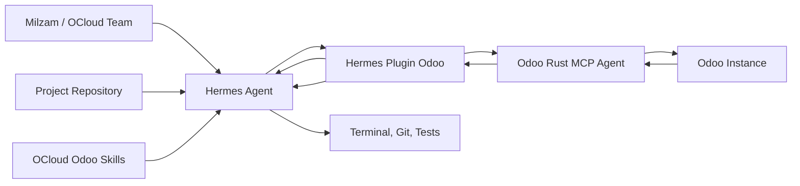
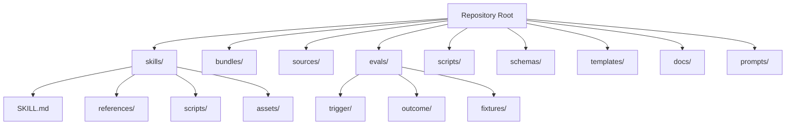
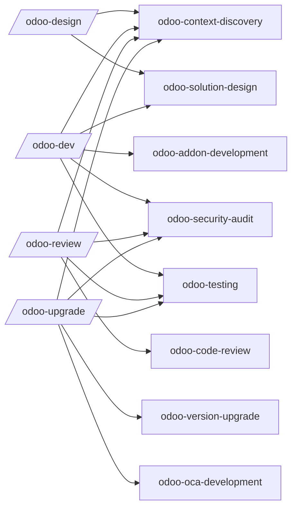
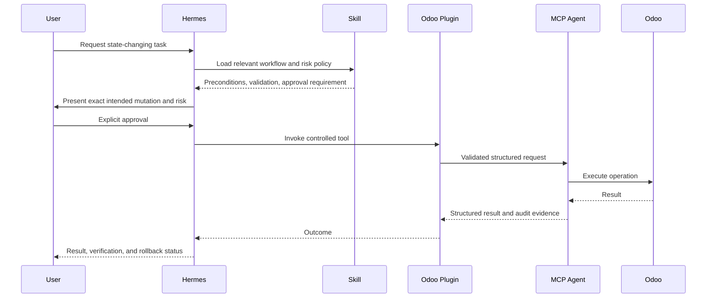
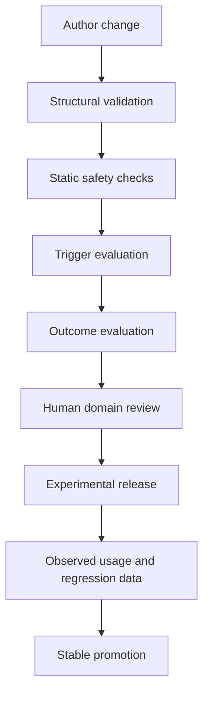

# Architecture

## 1. Architectural decision

OCloud Odoo Skills is a standalone repository. It is intentionally separated from `hermes-plugin-odoo` and `odoo-rust-mcp-agent`.

This separation allows knowledge, runtime integration, and precise execution to evolve independently.

## 2. System context



### Responsibilities

| Component | Responsibility |
|---|---|
| OCloud Odoo Skills | Procedural knowledge, decision frameworks, references, output contracts, safety guidance, and evaluation. |
| Hermes Agent | Skill discovery, progressive loading, reasoning, orchestration, and user interaction. |
| Hermes Plugin Odoo | Hermes-native tools, hooks, commands, configuration, approval policy, and MCP wrapping. |
| Odoo Rust MCP Agent | Precise Odoo metadata access and controlled operations with validation, idempotency, and audit logging. |
| Project repository | Source of truth for requirements, code, tests, and deployment instructions. |
| Odoo instance | Runtime system and business data. |

## 3. Repository architecture



## 4. Skill loading architecture

Agent Skills uses progressive disclosure:

1. Skill `name` and `description` are indexed.
2. The full `SKILL.md` is loaded when activated.
3. References, scripts, and assets are loaded only when required.

The architecture therefore keeps:

- trigger-critical intent in `description`;
- mandatory procedure and guardrails in `SKILL.md`;
- version details in `references/`;
- deterministic checks in `scripts/`;
- reusable output structures in `assets/`.

## 5. Skill composition

Skills are composed by Hermes bundles rather than nested into one super-skill.



## 6. Version-aware architecture

### 6.1 Baseline

- Primary stable cell: Odoo 18.0 Community.
- Verified-experimental cells: Odoo 17.0 Community/Enterprise, Odoo 18.0
  Enterprise, Odoo 19.0 Community/Enterprise, and Odoo 20.0 Community.
- Odoo 20.0 Enterprise and OCA 20.0 compatibility are unverified and must not
  be advertised. Odoo 20.0 Community status is source-evidence only until each
  skill passes its own reference/outcome evidence gates.
- Tier 3: Odoo 16.0, primarily for migration context.

The machine-readable status is authoritative in
`sources/VERSION-MATRIX.yaml`. Version and edition are separate support
dimensions; an Enterprise source tree does not make Enterprise behavior
available in Community or prove that an Enterprise module is installed.

### 6.2 Design

Version-neutral workflow remains in `SKILL.md`. Version-sensitive details remain in references selected after context discovery.

Example:

```text
skills/odoo-addon-development/
├── SKILL.md
└── references/
    ├── odoo-17.md
    ├── odoo-18.md
    ├── odoo-19.md
    ├── orm.md
    ├── views.md
    ├── owl.md
    └── testing.md
```

A version reference must describe only verified differences. It must not duplicate entire official documentation.

## 7. Safety architecture

### 7.1 Default boundaries

- Skills provide instructions; they do not contain credentials.
- Live Odoo access is read-only by default.
- Database-changing commands require explicit authorization.
- Destructive actions require preconditions and rollback planning.
- Executable scripts are reviewed as code, not trusted as prose attachments.
- External skill directories are not assumed to be read-only.

### 7.2 Approval sequence



## 8. Evaluation architecture

### 8.1 Layers

1. **Structural**: frontmatter, names, paths, links, and file size.
2. **Static safety**: secrets, dangerous command patterns, hidden downloads, unbounded deletion, and direct production assumptions.
3. **Trigger**: should-trigger and should-not-trigger prompt sets.
4. **Outcome**: fixture-based task scoring.
5. **Regression**: compare current release with previous stable release.
6. **Paired utility**: compare task completion with and without the skill where practical.

### 8.2 Evaluation flow



## 9. Distribution architecture

### 9.1 Hermes external directory

Best for local OCloud development and multi-agent shared directories.

### 9.2 Hermes custom tap

Best for published, versioned distribution and per-skill installation.

### 9.3 Repository-local installation

Projects may vendor or reference selected skills, but repository instructions remain authoritative.

### 9.4 Bundles

Bundles are copied or symlinked into the Hermes profile's `skill-bundles` directory. They are released alongside skills but installed separately.

## 10. Deployment levels

| Level | Use | Architecture |
|---|---|---|
| Development | Authoring and tests | Local clone, writable external directory, experimental skills. |
| Team controlled | OCloud internal use | Protected main branch, releases, read-only shared checkout, profile-specific bundles. |
| Public tap | Community distribution | Public GitHub repository, signed tags where feasible, changelog, provenance, security scanning. |
| Enterprise overlay | Client-specific private rules | Separate private repository layered through external directories; no client secrets in skill content. |

## 11. Key trade-offs

### Standalone repository vs plugin-bundled skills

Standalone is recommended because it improves portability and independent release. Plugin-bundled operational skills remain appropriate for tool-specific instructions.

### Shared references vs duplicated references

Shared references reduce duplication but can create deep cross-links and ambiguous packaging. The default is one-level skill-local references, with repository-wide policy documents used only for contributor guidance.

### Scripts vs prose

Use scripts when deterministic parsing or validation improves reliability. Do not add scripts merely to make a skill look technical; humans have already achieved sufficient ceremony without functional benefit.
