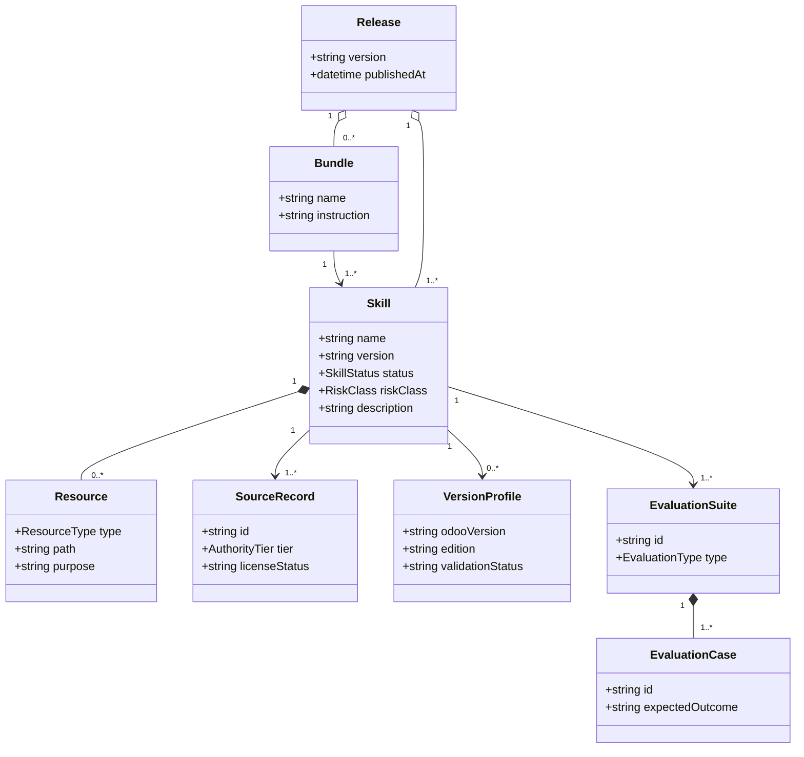
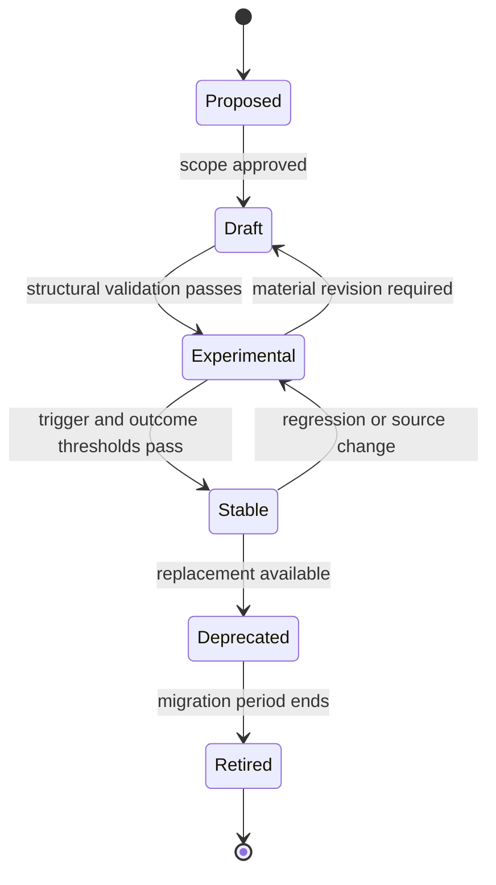
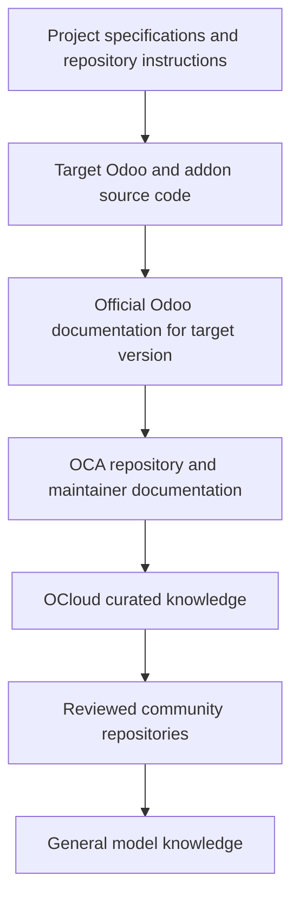

# Domain Model

## 1. Purpose

This document defines the conceptual entities, relationships, states, and invariants of the OCloud Odoo Skills repository. The domain model concerns skill lifecycle and governance, not the Odoo business data model of a customer instance.

## 2. Core entities

### 2.1 Skill

A reusable procedural package that teaches an agent when and how to perform one coherent task.

**Attributes**

- `name`: stable lowercase hyphenated identifier.
- `description`: trigger-oriented explanation of when the skill applies.
- `version`: semantic version of the skill package.
- `status`: draft, experimental, stable, deprecated, or retired.
- `scope`: intended task boundary.
- `compatibility`: runtime and environment constraints.
- `supported_odoo_versions`: explicit version set or discovery requirement.
- `supported_editions`: Community, Enterprise, or both.
- `risk_class`: advisory, read-only, controlled-write, or destructive.
- `owner`: accountable maintainer.
- `sources`: provenance references.

**Invariants**

- Directory name equals skill `name`.
- A skill has exactly one primary outcome.
- A skill cannot claim cross-version compatibility without tests or version-gated references.
- A skill cannot silently authorize destructive actions.
- A stable skill has trigger and outcome evaluations.

### 2.2 Skill instruction

The mandatory `SKILL.md` body loaded after activation. It contains the minimum workflow, decision rules, safety constraints, output contract, and directions for loading resources.

### 2.3 Resource

A file loaded only when needed.

**Types**

- `reference`: detailed knowledge or version-specific guidance.
- `script`: deterministic helper program.
- `asset`: template, fixture, or example input.
- `example`: optional worked scenario.

### 2.4 Bundle

A Hermes YAML alias that loads several already installed skills under one slash command.

**Attributes**

- `name`
- `description`
- `skills`
- `instruction`

**Invariant**

A bundle expresses a recurring task profile; it is not a dependency manager and must not be treated as installing its member skills.

### 2.5 Source record

A provenance record for official documentation, source repositories, OCA repositories, community skills, books, standards, or internal OCloud knowledge.

**Attributes**

- source identifier and URL;
- authority tier;
- applicable Odoo versions;
- license status;
- content usage mode: authoritative, reference, inspiration, test corpus, or prohibited-copy;
- last reviewed date;
- maintainer notes.

### 2.6 Version profile

A bounded set of known differences for an Odoo major version and edition.

**Attributes**

- major version;
- Community/Enterprise applicability;
- Python and PostgreSQL expectations when known;
- ORM, XML, OWL, assets, security, API, and migration notes;
- official source links;
- validation status.

### 2.7 Evaluation suite

A collection of repeatable tests for skill activation and task performance.

**Types**

- trigger evaluation;
- structural validation;
- script unit tests;
- static safety checks;
- fixture-based outcome evaluation;
- paired baseline evaluation with and without the skill;
- regression evaluation across skill releases.

### 2.8 Evaluation case

A single test scenario with input, expected activation, required findings, prohibited behavior, evidence, and scoring rules.

### 2.9 Release

An immutable published repository version containing skills, resources, source registry, bundles, and release notes.

### 2.10 Approval gate

A policy boundary requiring human authorization before an action or lifecycle transition.

Examples:

- promoting experimental skill to stable;
- adding executable scripts;
- enabling write-capable Odoo operations;
- importing third-party content;
- changing version support claims.

## 3. Relationships



## 4. Skill lifecycle



### 4.1 Proposed

A problem and intended outcome are identified, but no skill contract is approved.

### 4.2 Draft

The skill is being authored. Structure may change and evaluation may be incomplete.

### 4.3 Experimental

The skill is installable and structurally valid, but should be used only in controlled environments.

### 4.4 Stable

The skill has an owner, provenance, version support statement, trigger evaluation, outcome evaluation, and release notes.

### 4.5 Deprecated

The skill remains available temporarily but points users to a replacement or changed workflow.

### 4.6 Retired

The skill is removed from the active catalog. Historical releases remain available.

## 5. Odoo context model

Every Odoo engineering skill consumes or produces an `OdooContext` object conceptually containing:

```yaml
odoo:
  version: "18.0"
  edition: "enterprise"
  source_paths: []
  addons_paths: []
  enterprise_source_available: true
project:
  repository_root: "."
  instructions: []
  target_modules: []
  dependencies: []
  oca_repositories: []
runtime:
  deployment_type: "docker-compose"
  database_known: true
  environment: "development"
  test_command: null
  lint_command: null
business:
  domains: []
  multi_company: false
  multi_currency: false
  accounting_impact: false
  portal_exposure: false
risk:
  database_change_requires_approval: true
  production_access: false
  unresolved: []
```

## 6. Operation risk model

| Risk class | Examples | Default behavior |
|---|---|---|
| Advisory | analysis, design, review report | Allowed. |
| Read-only | source inspection, metadata lookup, `search_read` | Allowed when credentials and scope are authorized. |
| Controlled-write | create draft record, update sandbox configuration | Explicit user intent, validation, audit evidence, and rollback consideration. |
| Destructive | unlink, posted document reversal, module upgrade, database restore, direct SQL | Human approval, backup or disposable copy, preconditions, and rollback plan required. |

## 7. Source authority model



Higher tiers override lower tiers when they conflict. A lower-tier source may identify a question, but it cannot override observed target behavior without evidence.

## 8. Key bounded contexts

- **Authoring**: scope, write, reference, and validate skills.
- **Discovery**: identify available skills and trigger them accurately.
- **Execution guidance**: provide procedural instructions to an agent.
- **Evaluation**: measure activation, correctness, safety, and efficiency.
- **Provenance**: track source authority, license, and review status.
- **Distribution**: publish tap-compatible releases and bundle files.
- **Integration**: coordinate with Hermes plugin and Odoo MCP without embedding their implementation.
