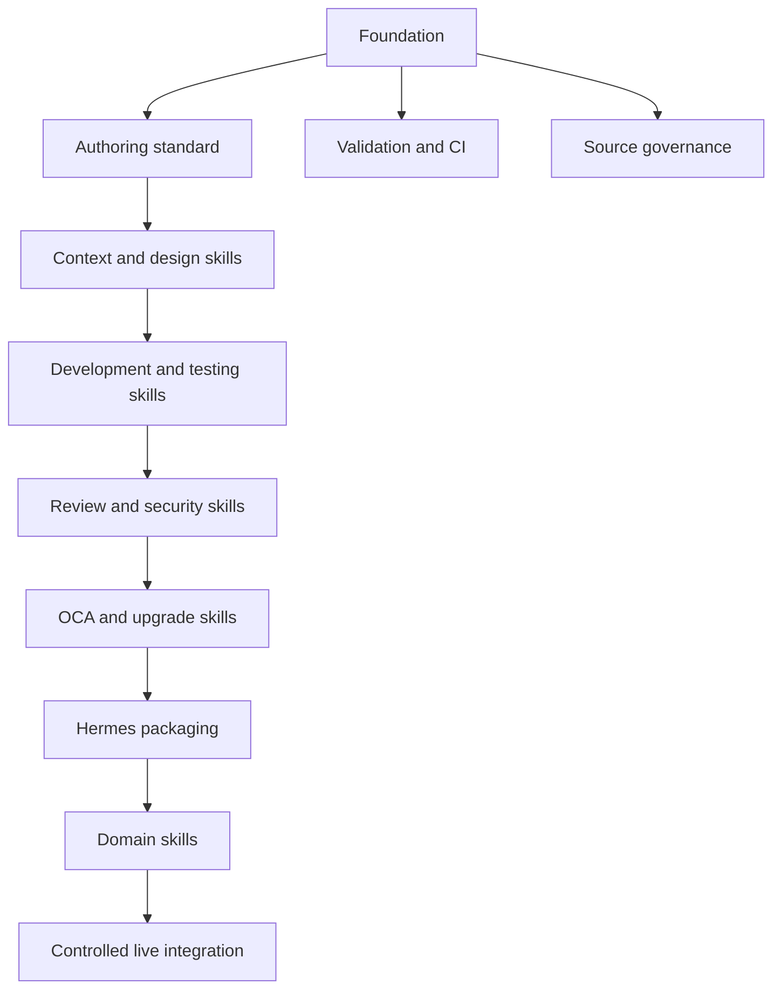

# Implementation Plan

## 1. Delivery strategy

Build the repository incrementally. Phase 1 establishes the authoring system and eight foundation skills. Domain skills are added only after the foundation is evaluated, because scaling an untested pattern merely distributes disappointment more efficiently.

## 2. Milestones

### Phase 0: Repository foundation

**Outcome:** a valid repository skeleton with governance and local tooling.

Tasks:

- create repository and branch protection;
- add root documentation;
- add source registry and clean-room policy;
- define schemas and metadata conventions;
- implement structural validation;
- implement static safety scan;
- add CI workflow;
- define release and contribution process.

Acceptance criteria:

- `make validate` passes;
- sample invalid fixtures fail for the expected reasons;
- source records identify authority and license review status;
- no secrets or client data exist in the repository.

### Phase 1A: Context and design

**Skills:**

- `odoo-context-discovery`
- `odoo-solution-design`

Tasks:

- author skill contracts;
- create output templates;
- add Odoo 18 baseline references;
- create trigger datasets;
- build fixture repositories for Community, Enterprise, OCA, and ambiguous contexts;
- evaluate version and edition detection;
- evaluate standard-before-custom decisions.

Acceptance criteria:

- context discovery identifies required evidence and unknowns;
- Enterprise is not inferred without evidence;
- solution design always evaluates standard, configuration, and OCA before custom code;
- trigger precision and recall meet target on validation cases.

### Phase 1B: Development and testing

**Skills:**

- `odoo-addon-development`
- `odoo-testing`

Tasks:

- define implementation workflow and output contract;
- add references for models, views, security, controllers, reports, assets, and migrations;
- define test seam decision table;
- create sample Odoo 18 addons with seeded defects;
- evaluate install, upgrade, access, and functional verification.

Acceptance criteria:

- skill output includes security and tests by default;
- no core modification is recommended without explicit exceptional rationale;
- fixture addon installs and tests in the controlled environment;
- unrelated refactoring is excluded.

### Phase 1C: Review and security

**Skills:**

- `odoo-code-review`
- `odoo-security-audit`

Tasks:

- define severity model;
- build defect corpus covering manifest, ORM, XML, ACL, record rule, controllers, `sudo()`, SQL, HTML, and multi-company;
- create report templates;
- add negative cases to prevent generic Python review over-triggering;
- compare skill-assisted review against baseline review.

Acceptance criteria:

- all seeded critical and high findings are detected;
- findings contain evidence, impact, remediation, and verification;
- speculative findings are labeled;
- security audit does not authorize unsafe exploitation or production mutation.

### Phase 1D: OCA and upgrades

**Skills:**

- `odoo-oca-development`
- `odoo-version-upgrade`

Tasks:

- register authoritative OCA and OpenUpgrade sources;
- define OCA repository discovery and branch rules;
- define compatibility versus feature-change separation;
- add migration fixture from Odoo 17 to 18;
- add database reconciliation checklist;
- include rollback and disposable-copy requirements.

Acceptance criteria:

- OCA guidance is branch-aware and repository-aware;
- migration output separates code, schema, data, configuration, and reconciliation work;
- no migration runs against the only database copy;
- financial and stock reconciliation is required when relevant.

### Phase 1E: Hermes packaging

**Outcome:** installable tap and usable bundles.

Tasks:

- add `skills.sh.json` categorization;
- verify direct skill installation path;
- add external-directory instructions;
- package four bundles;
- test bundle member resolution;
- document writable external-directory risk;
- publish experimental release.

Acceptance criteria:

- tap discovery lists all eight skills;
- each skill installs with referenced local files;
- bundle YAML resolves all members;
- missing bundle members are documented as non-fatal Hermes behavior;
- release notes state experimental limitations.

### Phase 2: OCloud domain skills

Priority order:

1. `odoo-functional-sales`
2. `odoo-functional-purchase`
3. `odoo-functional-inventory`
4. `odoo-functional-accounting`
5. `odoo-indonesia-accounting`
6. `odoo-integration-design`
7. `odoo-reporting`
8. `odoo-functional-pos`
9. `odoo-functional-manufacturing`
10. `odoo-deployment-operations`

Each domain skill must use foundation skills rather than duplicating their workflows.

### Phase 3: Controlled Odoo integration

Coordinate with:

- `hermes-plugin-odoo`;
- `odoo-rust-mcp-agent`.

Deliverables:

- read-only metadata discovery;
- approval-gated mutations;
- tool risk classification;
- idempotency contracts;
- audit records;
- dry-run or preview where feasible;
- private client overlays.

## 3. Work breakdown structure

## 4. Responsibilities

| Role | Responsibility |
|---|---|
| Product owner / solution architect | Scope, priorities, business and ERP decisions, acceptance. |
| Skill maintainer | Authoring, sources, evaluations, version support, changelog. |
| Odoo reviewer | ORM, views, security, edition, and upgrade validation. |
| Functional/accounting reviewer | Process, journal impact, reconciliation, tax, and localization. |
| Security reviewer | Script safety, permission model, tool boundaries, and secret scanning. |
| CI automation | Structural, schema, lint, unit, and static checks. |

## 5. Definition of done for a skill

- coherent scope and named owner;
- valid metadata and directory structure;
- explicit use and non-use cases;
- version and edition policy;
- required input and output contract;
- safety and escalation rules;
- conditional references;
- registered sources and license status;
- trigger evaluation with near-miss negatives;
- outcome evaluation;
- human domain review;
- changelog entry;
- successful packaging test.

## 6. Risks and mitigations

| Risk | Impact | Mitigation |
|---|---|---|
| Version leakage | Invalid code or migration advice | Context discovery, version references, regression fixtures. |
| Skill overlap | Wrong activation and context bloat | Outcome-based scope and near-miss trigger tests. |
| Community source copying | Legal and quality risk | Clean-room policy and source registry. |
| Unsafe scripts | Host or database damage | Review, dry-run, static scan, no credentials. |
| False completion | Defects reach production | Executable acceptance evidence. |
| Over-engineered framework | Maintenance burden | Begin with Python scripts and files; no service or database. |
| Stale guidance | Upgrade and security defects | Source review dates, support status, scheduled release review. |
| Agent modifies shared skills | Unreviewed repository changes | Filesystem permissions, branch protection, Hermes write approval. |

## 7. Release sequence

- `0.1.0`: repository foundation and context discovery.
- `0.2.0`: solution design, addon development, testing.
- `0.3.0`: review and security.
- `0.4.0`: OCA development and version upgrade.
- `0.5.0`: Hermes tap, bundles, and full Phase 1 evaluation.
- `1.0.0`: eight stable foundation skills with release evidence.

## 8. Immediate next tasks

1. Initialize the real repository.
2. Copy this documentation scaffold.
3. Implement validation scripts and CI.
4. Refine `odoo-context-discovery` against three real OCloud repositories.
5. Build the first trigger evaluation runner for the selected Hermes model profile.
6. Freeze the Phase 1 output contracts before expanding references.
