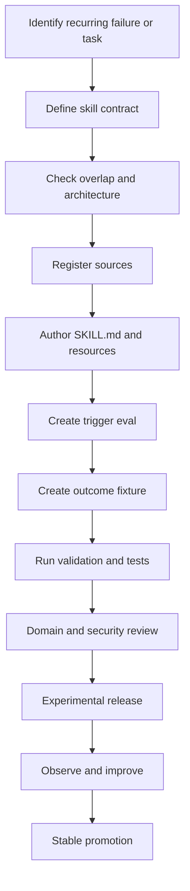

# Development Workflow

## 1. New skill workflow

## 2. Modify existing skill

1. Reproduce the problem with an evaluation case.
2. Identify whether the defect is trigger, workflow, reference, output, or safety behavior.
3. Make the smallest coherent change.
4. Update version metadata when behavior changes.
5. Run affected and cross-skill regressions.
6. Record source and changelog changes.

## 3. Add Odoo version support

1. Create a version profile and source record.
2. Inspect official source and documentation.
3. Identify only material differences.
4. Add version-specific fixture.
5. Run existing cases against the new version.
6. Mark support experimental until results pass.

## 4. Import concept from a public skill

1. Record the source and license status.
2. Describe the useful concept in original notes.
3. Verify the concept against official Odoo sources.
4. Write an original workflow fitting OCloud architecture.
5. Do not preserve copied phrasing or code unless license handling is approved.
6. Add an evaluation proving the imported concept has value.

## 5. Pull request workflow

- one coherent behavior change per PR when practical;
- include evaluation evidence;
- require appropriate reviewers;
- do not merge red validation;
- do not weaken safety to satisfy a fixture;
- squash or preserve commits according to repository policy, but retain changelog traceability.

## 6. Release workflow

1. Freeze scope.
2. Run full validation and regression.
3. Review source registry and license status.
4. Confirm versions and changelog.
5. Create signed tag where feasible.
6. Publish release notes.
7. Test tap installation from a clean Hermes profile.
8. Test bundle installation separately.
